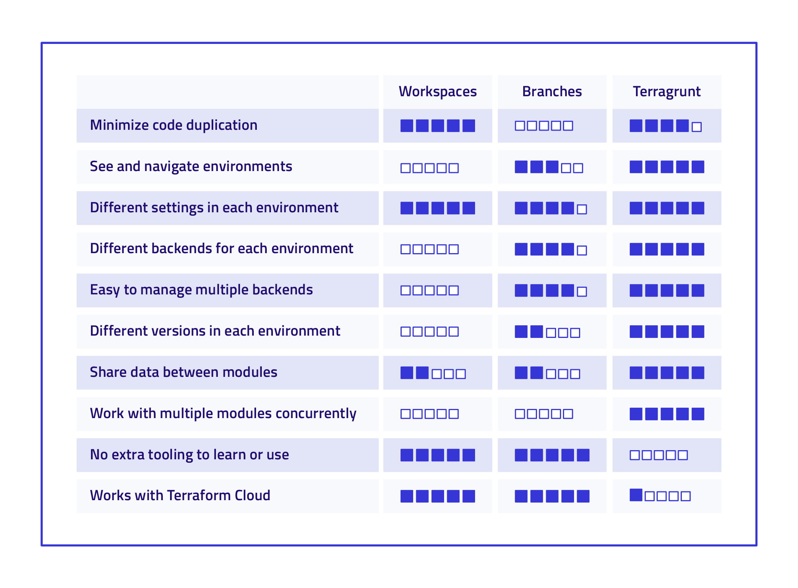

Uses:

- DRY code and configurations
- Versioning and environment management
- Dependency management
- Hooks for custom actions
- Keep your remote state configuration DRY
- Keep your CLI flags DRY
- Execute Terraform commands on multiple modules at once
- Work with multiple AWS accounts

Installing Terragrunt:

Mac:
```
 brew install terragrunt
```

Disadvantage:

- It adds an additional layer of complexity to your infrastructure management and may require more initial setup.
- It is also another tool to manage
- Doesn't work with Terraform Cloud



